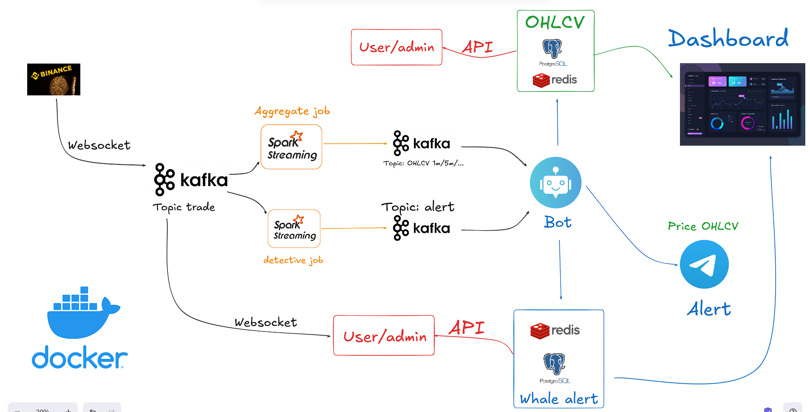
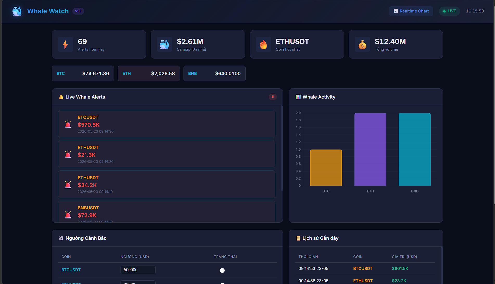
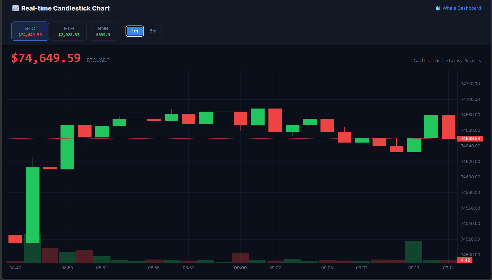
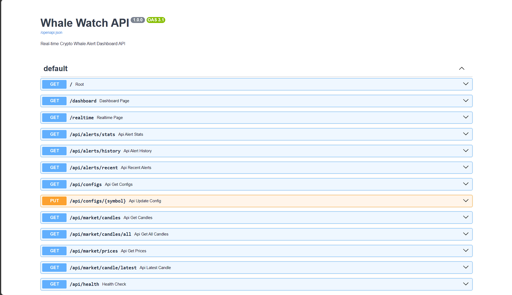
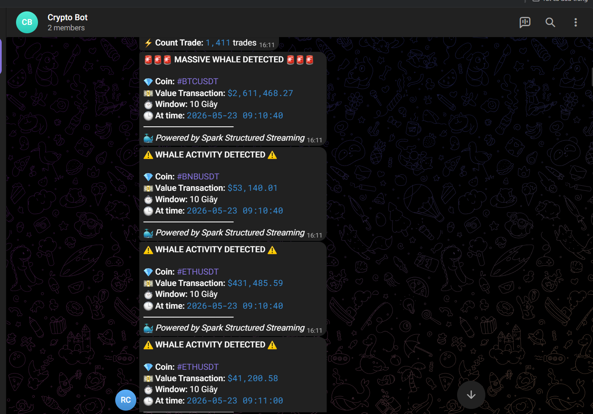
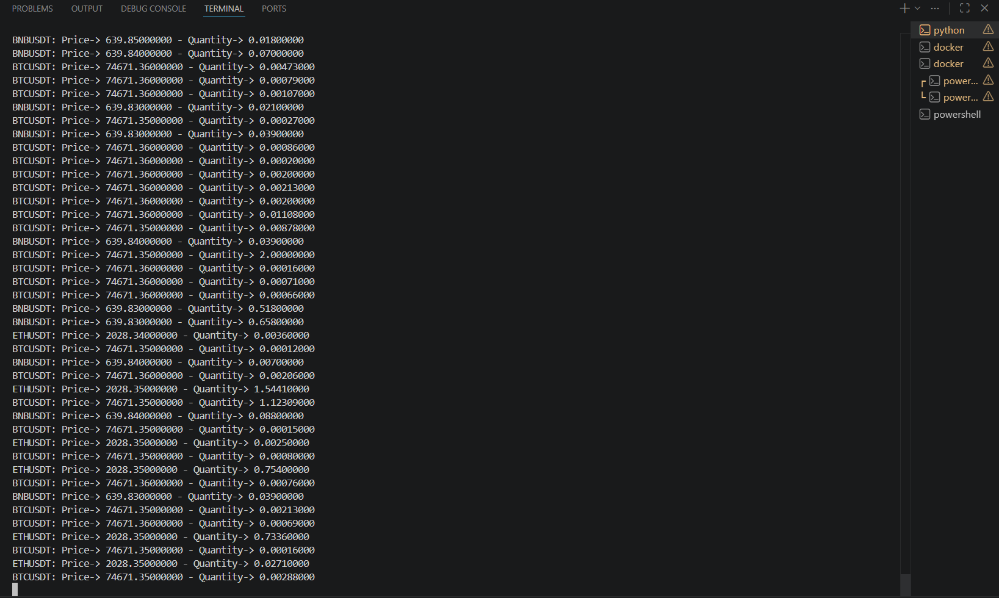
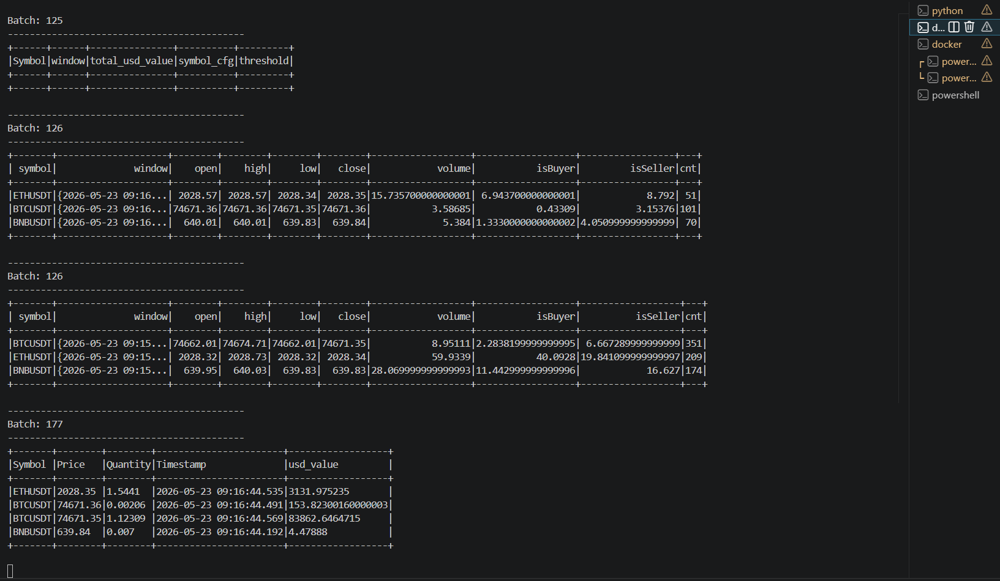
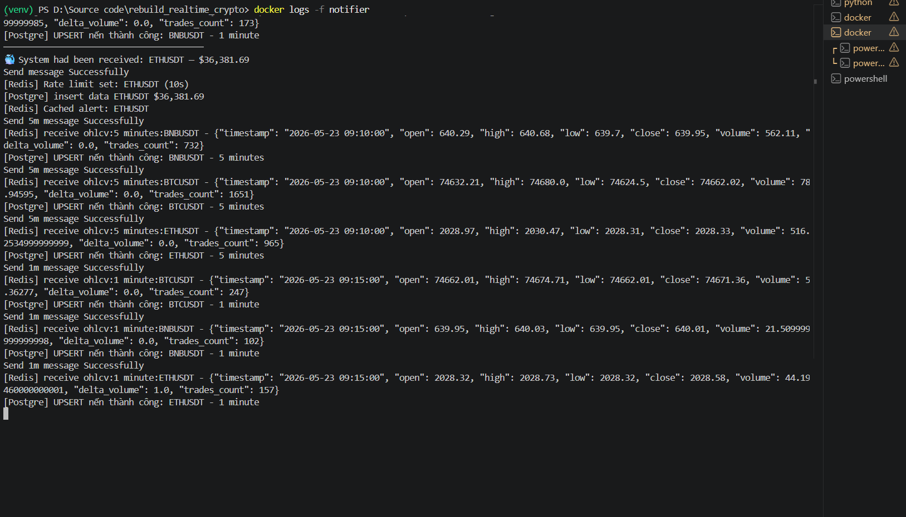
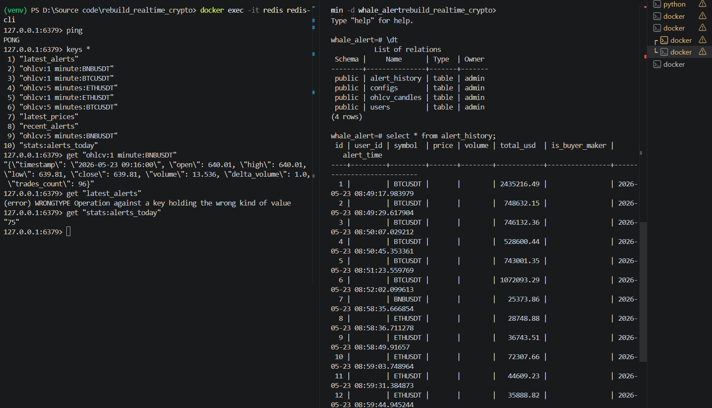

# Real-Time Crypto Whale Alert and Dashboard



## Overview
This project is a real-time data streaming and analytics pipeline for cryptocurrency markets. It connects to the Binance WebSocket API to capture live trades, processes them continuously using Apache Spark Streaming, and detects "Whale Alerts" (unusually large trades). It also computes 1-minute and 5-minute OHLCV (Open, High, Low, Close, Volume) candlestick data.

The processed data is saved to PostgreSQL and Redis, broadcasted to a frontend dashboard via WebSocket, and sent as instant alerts to Telegram.

## Core Technologies
- **Ingestion:** Python WebSocket Client (Binance API)
- **Message Broker:** Apache Kafka
- **Stream Processing:** Apache Spark Streaming
- **Database:** PostgreSQL (historical data)
- **Cache / Real-time State:** Redis
- **Backend API:** FastAPI (Python)
- **Frontend UI:** HTML/JS with LightweightCharts
- **Notifications:** Telegram Bot API
- **Containerization:** Docker & Docker Compose

## Features
- Connects to Binance live trade streams (BTCUSDT, ETHUSDT, BNBUSDT).
- Real-time Spark data processing and window aggregations.
- Persistent storage for historical OHLCV candles.
- Live Web Dashboard to view whale alert statistics.
- Interactive Real-time Candlestick charts with auto-updating price and volume.
- Automated Telegram notifications for massive transactions.

---

## Application Previews

### Dashboard & Real-Time Charts



### API Endpoints


### Telegram Notifications


---

## Setup and Installation

### Prerequisites
- Docker and Docker Compose installed.
- Python 3.9 or higher.
- A Telegram Bot Token and Chat ID.

### 1. Environment Configuration
Create the `.env` file from the example template and fill in your Telegram bot credentials:
```bash
cp .example.env .env
```

### 2. Start Infrastructure
Build the images (without cache) and start all containerized services:
```bash
docker compose build --no-cache
docker compose up -d
```

### 3. Install Local Dependencies
Install the required packages for the data ingestor script:
```bash
npm install
pip install kafka-python==2.3.1 websocket-client==65.5.0
```

### 4. Run the Data Ingestor
Run the Python script locally to open the Binance WebSocket connection and push live trades into Kafka:
```bash
python services/ingestor/main.py
```


### 5. Submit the Spark Streaming Job
Trigger the Apache Spark job inside the `spark-master` container to begin processing the stream:
```bash
docker exec -it spark-master /opt/spark/bin/spark-submit \
  --driver-memory 512m \
  --executor-memory 1g \
  --packages org.apache.spark:spark-sql-kafka-0-10_2.12:3.5.1 \
  /opt/spark/work-dir/app/main.py
```


---

## Accessing the Services

Once the system is fully running, you can access the following interfaces:

- **Main Dashboard:** [http://localhost:8000/dashboard](http://localhost:8000/dashboard)
- **Real-Time Candlestick Chart:** [http://localhost:8000/realtime](http://localhost:8000/realtime)
- **API Documentation (Swagger UI):** [http://localhost:8000/docs](http://localhost:8000/docs)

## Debugging & Verification

You can verify the background processes by checking logs or querying the database directly.

**Notifier Service Logs:**
```bash
docker logs notifier
```


**PostgreSQL Database Query:**
Connect to the `whale_alert` database to check saved OHLCV candles.


## Demo
- **Video Walkthrough:** [YouTube Link](https://youtu.be/Wwaummg0wuE)